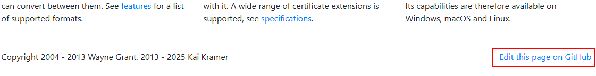

# Source of the KeyStore Explorer website

Here is the Source code of the KeyStore Explorer website: https://keystore-explorer.org.

---

## Contributing to the Documentation or Website

Good documentation is crucial for any kind of software. You can help improving the documentation:
* Please report missing, incorrect, or out-dated documentation as an
[issue](https://github.com/kaikramer/keystore-explorer/issues).
* The [KSE website](https://keystore-explorer.org) is in a [GitHub
repository](https://github.com/kaikramer/kaikramer.github.io) just like the KSE
source code, which means improvements for the website can be contributed in the
same way as code contributions. Or you could open an
[issue](https://github.com/kaikramer/keystore-explorer/issues) if you think the
website could be improved, but don't want to do it yourself.

Every page of this website has a "Edit this page" link at the bottom. This will take you to the
GitHub repository where you can propose changes to the page:




## Building and Running the Website Locally

This website is built using the static site generator [Jekyll](https://jekyllrb.com/) because
at the beginning this was the only one supported by GitHub Pages.

To build and run the website locally, you need to have Ruby, Jekyll and Bundler installed.
GitHub provides a [guide](https://docs.github.com/en/pages/setting-up-a-github-pages-site-with-jekyll/testing-your-github-pages-site-locally-with-jekyll) on how to do this.

To build and run the website locally, execute these commands in the root directory of the repository:

```bash
# Install the required gems
bundle install

# Run the website locally
bundle exec jekyll serve --watch --force_polling --incremental --host=0.0.0.0
```
This will start a local web server on port 4000. You can access the website at
[http://localhost:4000/index.html](http://localhost:4000/index.html).

---
See also: [main page about Contributing to the KeyStore Explorer Project](https://github.com/kaikramer/keystore-explorer/blob/main/CONTRIBUTING.md)
